# 三星手机 magisk+root (中文,Chinese)
# Samsung Smartphones magisk+root (English,英文)

示例手机型号/Example phone model:

Samsung Galaxy S21

目录/memu
---
[`警告!Warning`](#`!!!!!!警告!!!!!!Warning!!!!!!`)

[开始/Begining](#开始/Begining)

- [三星手机 magisk+root (中文,Chinese)](#三星手机-magiskroot-中文chinese)
- [Samsung Smartphones magisk+root (English,英文)](#samsung-smartphones-magiskroot-english英文)
	- [目录/memu](#目录memu)
	- [`!!!!!!警告!!!!!!Warning!!!!!!`](#警告warning)
- [开始/Begining](#开始begining)
	- [1. 备份/backup](#1-备份backup)
	- [2. `退出账户/logout(非常重要/very important)`](#2-退出账户logout非常重要very-important)
	- [3. 解锁/unlock](#3-解锁unlock)
	- [4. 计算机上安装必要组件/Install the necessary components on your computer:](#4-计算机上安装必要组件install-the-necessary-components-on-your-computer)
	- [5. 下载你的三星手机对应的最新固件./Download the latest firmware for your Samsung phone.](#5-下载你的三星手机对应的最新固件download-the-latest-firmware-for-your-samsung-phone)
	- [6. 刷入官方系统(先不修补)/Flash into the official system (don't patch it first)](#6-刷入官方系统先不修补flash-into-the-official-system-dont-patch-it-first)
	- [7.正常激活手机,下载Magisk或Magisk Delta./Activate your phone normally and download Magisk or Magisk Delta.](#7正常激活手机下载magisk或magisk-deltaactivate-your-phone-normally-and-download-magisk-or-magisk-delta)
	- [8. 修补/Patch](#8-修补patch)
	- [9. 刷入(Flash)](#9-刷入flash)
	- [10.还未结束!/Last but not least.](#10还未结束last-but-not-least)

## `!!!!!!警告!!!!!!Warning!!!!!!`
> > ))) 手机一但root,你会拥有手机所有权,但如果操作不当,就会造成`系统不正常`,`丢失数据`甚至变成`"砖块"`.
> >
> > ))) 三星手机root前必须`解锁bootloader(BL),退出三星账户和google账户`.非中国国行的三星手机可能还需要解锁`KG锁/网络锁`(请自行查阅资料).
> >
> > ))) 三星手机解锁bootloader后会`物理熔断` [knox](https://samsung.com/security),导致三星钱包不可用,失去保修和安全文件夹不可用,并`清除数据`.
>
> > ))) Once the phone is rooted, you will have the ownership of the phone, but if it is not operated properly, it will cause the `system to be abnormal`, `lose data` or even become a `"brick"`.
> >
> > ))) Samsung phones must unlock bootloader(BL) before rooting, exit Samsung account and Google account.Samsung phones that are not CHC may also need to unlock the `KG lock/network lock` (please consult the information by yourself).
> >
> > ))) Samsung phone will `physically fuse` [knox](https://samsung.com/security) after unlocking bootloader, resulting in Samsung pay unavailability, loss of warranty and unavailability of secure folders, and `clearing of data`.

[我已经备份(或删除数据),退出账户并解锁bootloader(点此跳过) I have backed up (or deleted data), logged out of the account and unlocked bootloader (click here to skip)](#4-计算机上安装必要组件install-the-necessary-components-on-your-computer)

---

# 开始/Begining
## 1. 备份/backup
[已经备份了(或我想删除数据)(点此跳过)/Already backed up (or I want to delete data)(click here to skip)](#2-退出账户logout非常重要very-important)

> ||| 经过本人测试,[三星云](https://support.samsungcloud.com)在root后仍可以`正常使用`,所以你可以使用三星云进行备份,但`应用数据会丢失`.(包括账户信息,游戏进度,聊天记录等)
>
> ||| After my own test, [Samsung Cloud](https://support.samsungcloud.com) can still be `used normally` after rooting, so you can use Samsung Cloud for backup, but `application data will be lost`. (including account information, game progress, chat history, etc.)
>
>  

## 2. `退出账户/logout(非常重要/very important)`
> 

## 3. 解锁/unlock
[已经解锁bootloader(点此跳过)/Already unlocked bootloader (click here to skip)](#4-计算机上安装必要组件install-the-necessary-components-on-your-computer)

> ||| 设置 -> 开发者选项(关于手机 -> 软件信息 -> 编译编号_3次) -> 允许OEM解锁
>
> ||| Settings -> Developer options(About phone -> Software information -> Build number_3 times) -> OEM unlocking
>
> 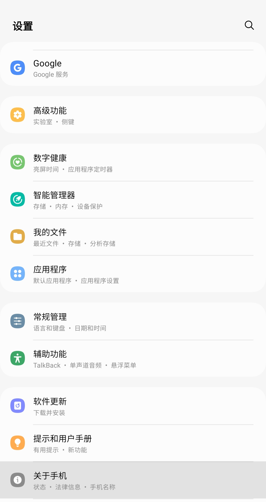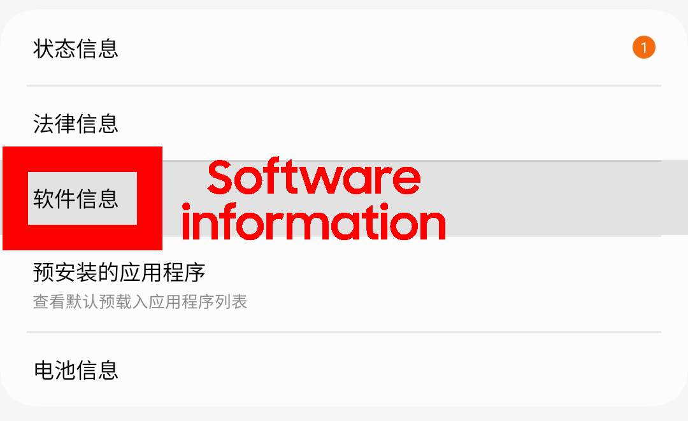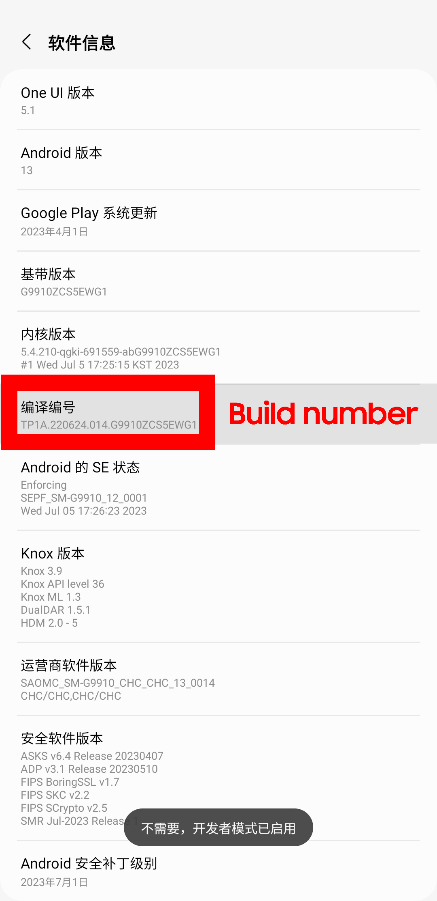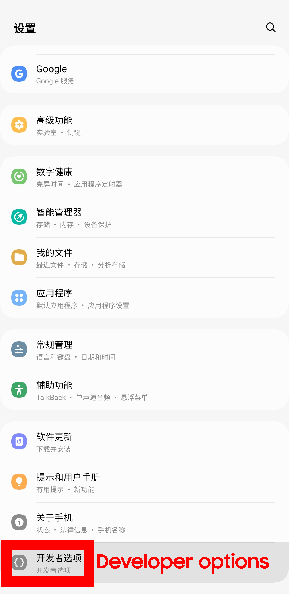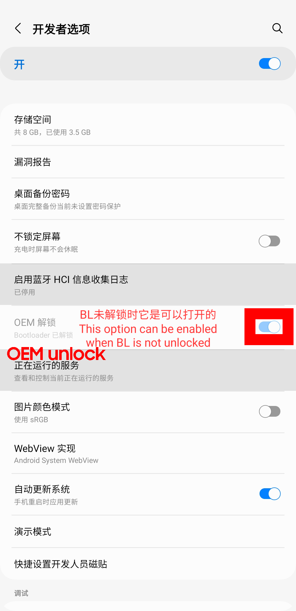

> 关机并解锁bootloader/Poweroff and unlock bootloader
>
>  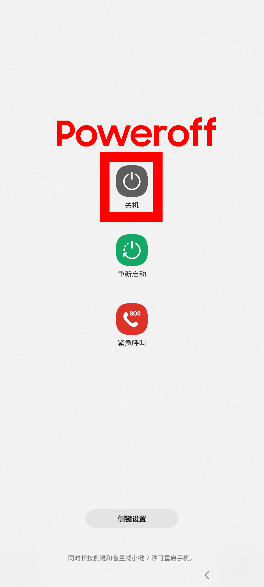 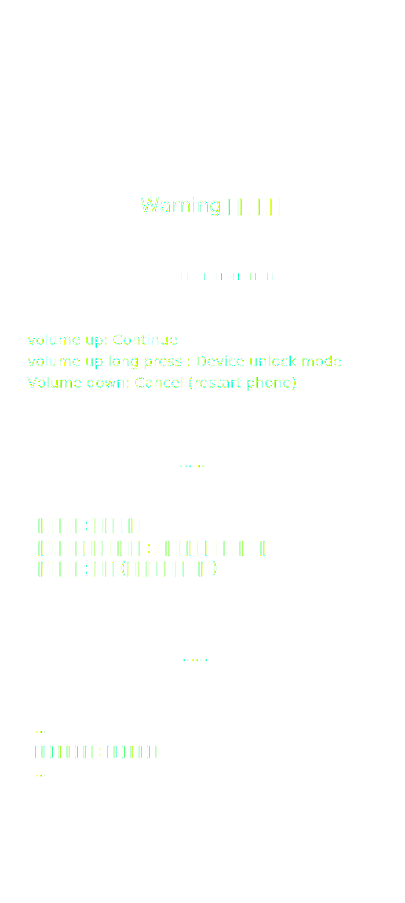   

请等待一段时间.你可以趁这个时间下载 Odin3 和 SamFirm以及必要组件.

Please wait for a while.You can download Odin3, SamFirm and the necessary components during this time.

## 4. 计算机上安装必要组件/Install the necessary components on your computer:
>
> 点击按钮下载 Odin3 和 SamFirm 以及必要组件.
> 
> 
>
> Click button to download Odin3, SamFirm and the necessary components.
> 
>
> > 解压缩并以管理员身份运行/Unzip and run as administrator:
> >
> > `dotNetFx35setup,SAMSUNG_USB_Driver_for_Mobile_Phones,VC*redist*`
> >
> > 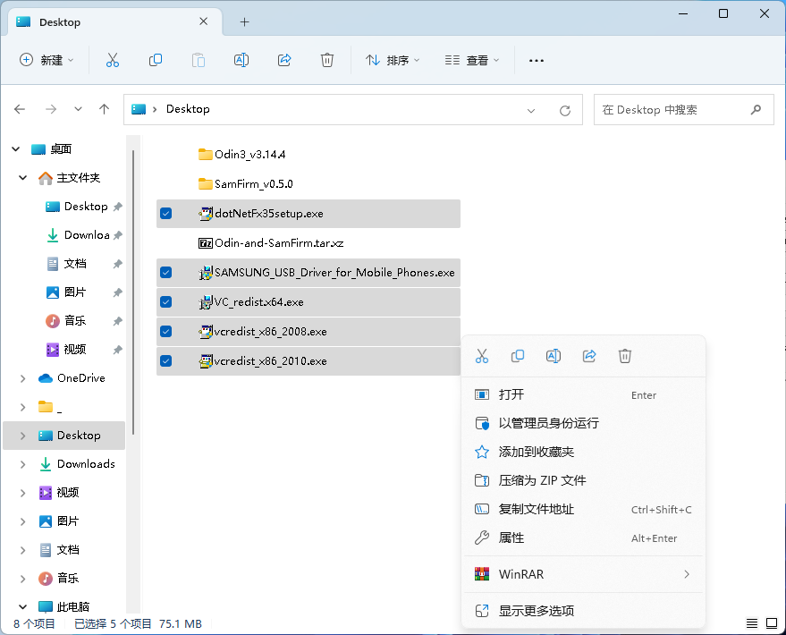
> >
> > 接下来你的电脑会收到更新重启,一般20分钟就能完成./Your computer will then receive an update restart, which will usually take 20 minutes

## 5. 下载你的三星手机对应的最新固件./Download the latest firmware for your Samsung phone.

> 打开/Open `SamFirm`
>
> 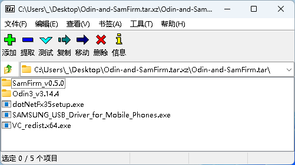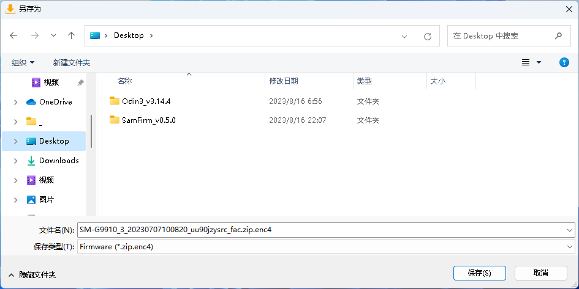
>
> __由于下载的固件还需要由软件解密,所以不要以为速度为0kb/s就是下载完了.__
>
> __Since the downloaded firmware also needs to be decrypted by the software, do not think that a speed of 0kb/s means that the download is finished.__
>
> 等待约半小时/Wait about half an hour
>
> 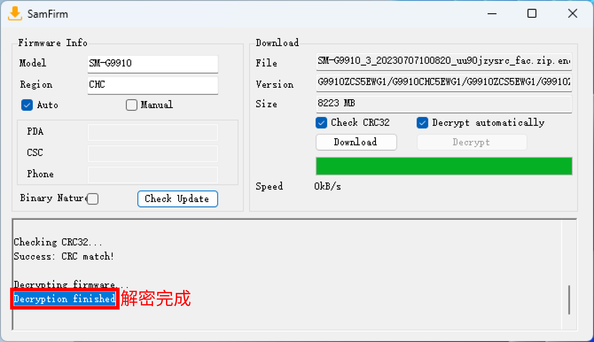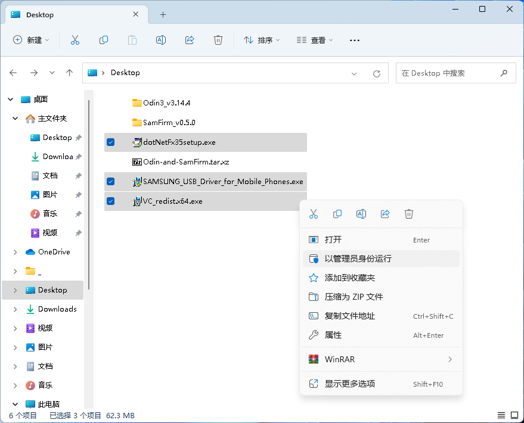
>
> 解压固件包后你就可以得到三星刷机5件套./After unzipping the firmware package, you can get the Samsung flashing 5-piece set.

## 6. 刷入官方系统(先不修补)/Flash into the official system (don't patch it first)
> 手机关机,进入下载模式./Turn off your phone and enter the download mode.
>
>      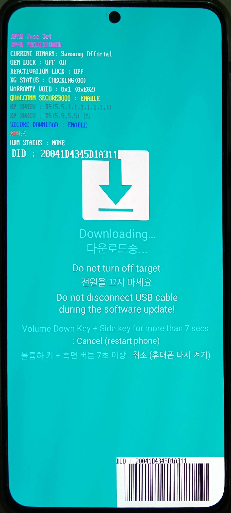
>
> 在你的计算机上电脑打开 odin3./Open odin3 on your computer.
>
> 将BL,AP,CP,CSC打钩,选择对应前缀的刷机包,注意CSC要选择`CSC_CSC`而不是HOME_CSC
>
> Tick BL, AP, CP, CSC, select the flashing package with the corresponding prefix, and note that CSC should select `CSC_CSC` instead of HOME_CSC
>
> 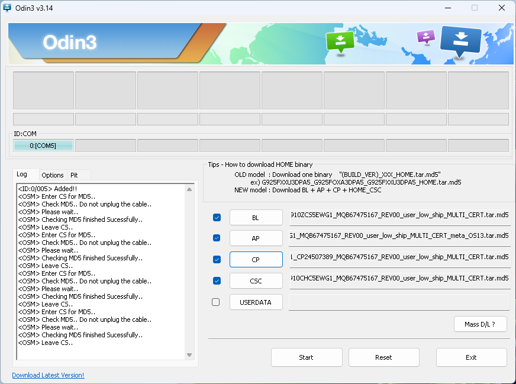
>
> 等待5分钟./Wait 5 minutes.
>
> 你的手机会清除数据并自动重启./Your phone will clear the data and restart automatically
>
> 如果系统能正常进入"欢迎"界面,那么你离root成功又进了一步,否则请[点击返回](#5-下载你的三星手机对应的最新固件download-the-latest-firmware-for-your-samsung-phone)
>
> If the system can enter the "Welcome" screen normally, then you are one step closer to root success, otherwise please [click to return](#5-下载你的三星手机对应的最新固件download-the-latest-firmware-for-your-samsung-phone)

## 7.正常激活手机,下载Magisk或Magisk Delta./Activate your phone normally and download Magisk or Magisk Delta.

URL:
- Magisk: [https://gitee.com/linux-rm/linux-rm/releases/download/magisk/Magisk-v26.1.apk](https://gitee.com/linux-rm/linux-rm/releases/download/magisk/Magisk-v26.1.apk)
- Magisk Delta: [https://gitee.com/linux-rm/linux-rm/releases/download/magisk/Magisk-Delta-Debug.apk](https://gitee.com/linux-rm/linux-rm/releases/download/magisk/Magisk-Delta-Debug.apk)

Use (k)github? Change "gitee.com" to "(k)github.com" in the URL.

## 8. 修补/Patch
> 在电脑上复制AP文件到手机/Copy the AP file on the computer to the phone.
>
> 
>
> 打开/Open Magisk(Delta)
>
> 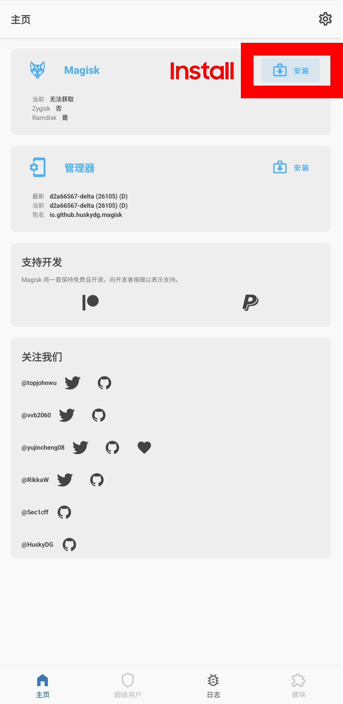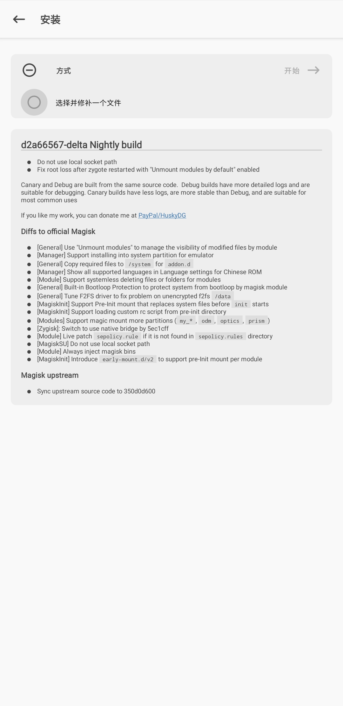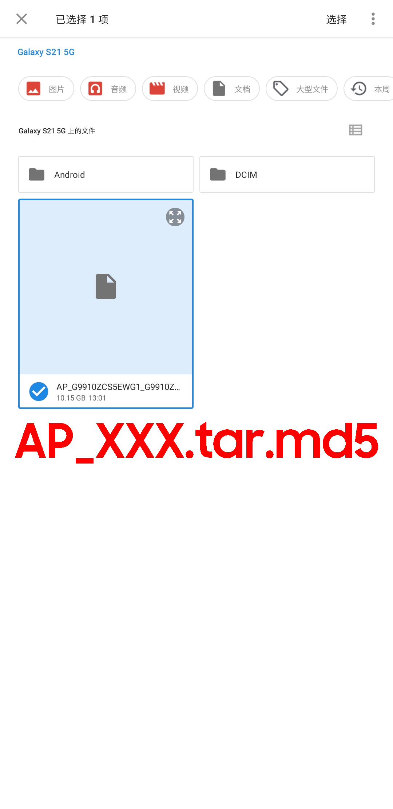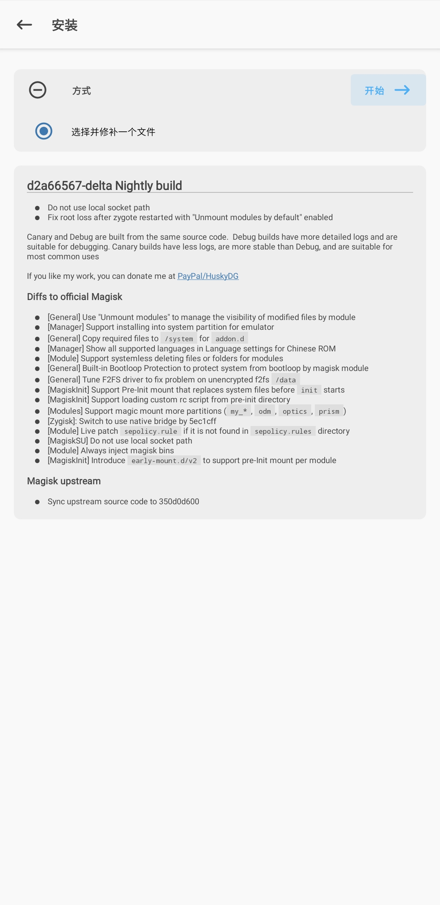
>
> 把修补后的文件复制到电脑上./Copy the patched files to your computer.
>
> Path: /storage/emulated/0/Download/magisk_patch-xxx
>

## 9. 刷入(Flash)
同/Same as [#6](#6-刷入官方系统先不修补flash-into-the-official-system-dont-patch-it-first).

但AP改为修补后的文件./But the AP changes to the patched file.

如果刷入成功,你会看到带黄色感叹号的警告信息.

If the flash is successful, you'll see a warning message with a yellow exclamation mark.

若出现错误,则按音量键让其选择`Factory reset(恢复出场设置)`,并按下侧键进行确认.

If an error occurs, press the volume key to select 'Factory reset' and press the side button to confirm.

提示: 你的 ROOT 不会因为恢复出厂设置而丢失.

Tips: Your ROOT will not be lost due to factory reset.

## 10.还未结束!/Last but not least.
当你激活手机时,会报错 `[2002] -45` ,不必担心,以下是解决方法:

When you activate your phone, it says '[2002] -45', don't worry, here's how to fix it:

